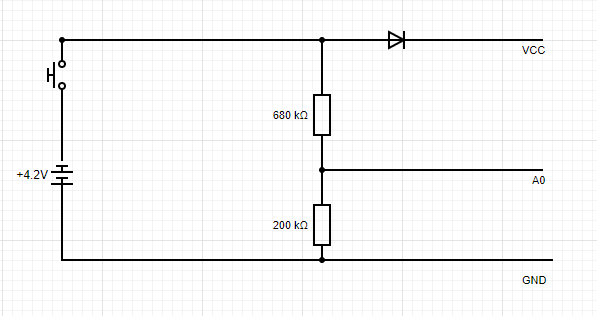

# ESPNOW2MQTT

This is my attempt to create a real-time ESPNOW to MQTT bridge. I found the ESPNOW protocol quite interesting, simple and super fast way to send datagrams over wifi to another ESP node. Unfortunately while your wifi is in ESPNOW mode you can not be on any other WiFi network in regular STA mode. Bummer. My approach is to create a received using two ESP boards. I opted in for the ESP32 for the wifi node as it has more capabilities and serials.

# The Button
There are two components the button and the receiver. The button consists of a small 3.7v pouch battery, a button a diode and of course an ESP8266. Make sure you pick one that is just the chip, you don't want the USB-Serial chip to steal valuable milliamps from the small pouch :) 

As you can see it also includes two resistors - acting as a divider to bring down battery voltage to something our ADC can sense. 680k/200k ratio will yield 1v at 4.4v - a level which we should never reach with a healthy batter pack.

This is how it looks in my implementation:

When you press the button it gets power through the diode, which will drop 0.7v from whatever the battery voltage is. This leaves us with a much smaller range of operation, but consumption is nominal 150ma for about 100ms per push. Depending on your battery size we should be enough for 5-6k presses before the battery reaches critical levels. For my experiment anything beyond a year is sufficient.

# The Receiver
I wired up my ESP32 to my ESP8266 like this:

    ESP32      ESP8266
    D16    --  D8
    D17    --  D7
    GND    --  GND
    3.3v   --  3.3v
   
This uses Serial2 on the ESP32 and the alternate serial pins on the ESP8266 so it won't interfere with uploading code.

# How does it work?
When the button sends the ESPNOW datagram the received ESP8266 gets it and sends a message via serial to the ESP32. The ESP32 is connected to my home wifi network and my MQTT bridge - it relays the received message to my home automation system via MQTT.

The code is really "poc" grade, lot to be improved but it works, and I need the MVP in prod ASAP :)
Here is a lame youtube video - me talking about the components and showing the finished result.

https://youtu.be/DOoqh8FJ0UE

